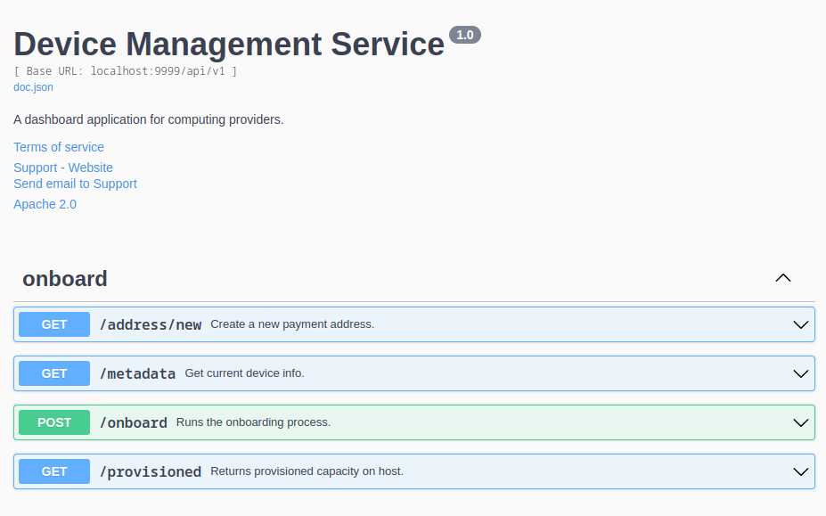

# device-management-service

The backend of the device management app.

## Getting Started with Development

### Setup Development Environment

On Debian-based systems, this command should get you ready with the installation.

```
sudo apt install build-essential curl golang jq
```

Similarly, on RHEL based system, the equivalent command would be:

```
sudo yum group install "Development Tools"
sudo yum install curl golang jq
```

Please make sure you have the appropriate Go version installed. We work with and test against the latest Go release. You can find the version we are using in the go.mod file.

### Build and Run the server


If you have Go installed, next install the packages:

    go install

and then run the main.go

    sudo go run main.go

Notice that I'm using `sudo` as the onboarding process writes some configuration files to `/etc/nunet`.

## Operations/Endpoints

All the endpoints mentioned below should be prefixed with `/api/v1`.



The above mentioned documentation is available at <http://localhost:9999/swagger/index.html> while the API server is running.
### Provisioned Capacity

`GET /provisioned` endpoint returns some info about the host machine, which will be used to decide how much capacity can be given to NuNet. See `POST /onboard`.

```
$ curl -s localhost:9999/api/v1/provisioned | jq .
{
  "cpu": 32800,
  "memory": 15843,
  "total_cores": 8
}
```

### Create a new Wallet Address

`GET /address/new` returns a wallet address and a private key. Keep the private key safe.

An example response looks like this:

```json
{
    "address": "0xa7Bd395Aaf64b354dD4e2695cDCcF00F6bA1748b",
    "private_key": "0x7e855c8cf00668fbe9560cd4927b344074dc072fb872708b5b68ac3319bb918f"
}
```

The first element is the wallet address and the second is the private key.

### Onboard Current Machine

`POST /onboard` onboards a new machine. Right now it onboards a machine on which the service is running.

#### Prerequisites

There are a few things you need to know before you try to onboard.

0. First, hit `GET /provisioned` to know how much `cpu` and `memory` your machine is equipped with. You'll be using this info in the JSON body of the `POST /onboard` endpoint.

1. **Channel**: We currently have two channels, `nunet-development` and `nunet-private-alpha`. The former one has the cutting-edge version of the system. `nunet-private-alpha` is one of the milestone channels.

2. **Payment Address**: This is your Ethereum wallet address. If you don't have an existing address, you can use that, or you can use the `GET /address/new` endpoint to generate a new Ethereum mainnet address.

3. **Cardano**: This one is optional, and indicates whether you want your device to be a Cardano node. Please note that to be eligible for this, you must onboard at least *10000MB* of memory and *6000MHz* of compute capacity.

A typical body would look like this:

```json
{
    "memory": 4000,
    "cpu": 4000,
    "channel": "nunet-private-alpha",
    "payment_addr": "0x0541422b9e05e9f0c0c9b393313279aada6eabb2",
    "cardano": false
}
```

If you are using curl, save above json in onboard.json and run below command:

```
curl -XPOST -d @onboard.json  http://localhost:9999/api/v1/onboard | jq .
```

The server should respond with contents of metadata.json.
